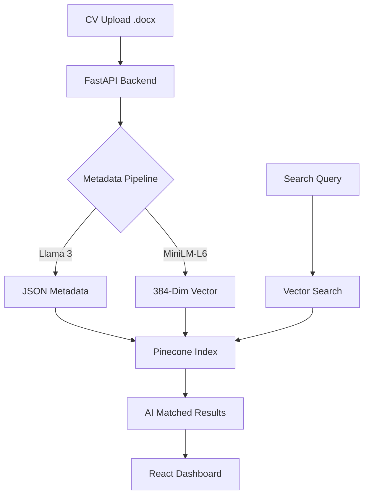

# 🚀 AI Talent Matcher — Advanced Semantic Recruitment Portal

Modern insan kaynakları süreçleri için geliştirilmiş, **Retrieval-Augmented Generation (RAG)** tabanlı akıllı bir aday eşleştirme ve yönetim panelidir. İK uzmanlarını yüzlerce CV okuma derdinden kurtarır ve en uygun yetenekleri saniyeler içinde listeler.

[](https://fastapi.tiangolo.com/)
[](https://reactjs.org/)
[](https://www.pinecone.io/)
[](https://github.com/Serifenurr/ai-talent-matcher)

---

## ✨ Temel Özellikler

*   **🧠 Akıllı Vektörel Arama:** Adayların yeteneklerini ve tecrübelerini sadece anahtar kelimelerle değil, cümlenin anlamsal (semantic) yapısıyla arar.
*   **📄 Otomatik Veri Ayıklama:** Sisteme yüklenen `.docx` formatındaki CV'leri okur; Groq (Llama 3) kullanarak tecrübe yılı, özet ve yetenekleri otomatik analiz eder.
*   **☁️ Cloud Vector DB (Pinecone):** Hızlı ve ölçeklenebilir hibrit arama (Metadata + Vektör) altyapısı.
*   **🎯 Talent Pipeline (Değerlendirme Havuzu):** Seçilen favori adayların karşılaştırılabileceği, özel notlar alınabileceği ve süreç durumlarının (Mülakat, Red, Teklif) yönetilebileceği özel havuz sistemi.
*   **🔒 Misafir (Guest) Modu:** Aday silme/ekleme işlemlerinin kapatıldığı, sadece arama ve shortlist özelliklerinin test edilebildiği güvenli demo arayüzü.
*   **⚔️ Side-by-Side Kıyaslama:** Seçilen adayları yan yana getirerek yetenek ve tecrübe kıyaslaması yapma imkanı.

---

## 🛠️ Teknolojik Altyapı (Tech Stack)

### **Frontend**
- **React.js (Vite):** Yüksek performanslı ve modern kullanıcı arayüzü.
- **Framer Motion:** Akıcı geçişler ve profesyonel mikro animasyonlar.
- **Lucide React:** Minimalist ikon seti.

### **Backend**
- **FastAPI (Python):** Hızlı ve asenkron API altyapısı.
- **Pinecone:** Vektörel veritabanı (Similarity Search).
- **Yapay Zeka & LLM:** LangChain, Groq API (Llama 3 70B), Sentence-Transformers (`all-MiniLM-L6-v2`)

---

## 🏗️ Mimari Akış (Architecture)



---

## 💻 Kurulum ve Çalıştırma (Local Development)

Proje gereksinimleri için bilgisayarınızda **Python 3.10+** ve **Node.js** kurulu olmalıdır.

### 1. Backend Kurulumu
```bash
# Depoyu klonlayın
git clone https://github.com/Serifenurr/ai-talent-matcher.git
cd ai-talent-matcher

# Sanal ortam oluşturun ve aktif edin
python -m venv venv
source venv/bin/activate  # Windows: .\venv\Scripts\activate

# Gerekli paketleri kurun
pip install -r requirements.txt

# .env dosyasını yapılandırın (Pinecone, Groq ve Şifre)
```

### 2. Frontend Kurulumu
```bash
cd frontend
npm install
npm run dev
```

---

## 🎨 Tasarım ve Deneyim

Sistem, **"Midnight Intelligence"** adı verilen özel bir tasarım diliyle sunulmaktadır:
- **Tema:** Dark Mode (Gece Moru & Cyber Blue).
- **Görsellik:** Altın neon efektli modern **Lion Logo**, Glassmorphism kart tasarımları ve premium gölgelendirmeler.
- **Slogan:** "Yetenekleri matematiksel bir kesinlikle eşleştirin."

---

**Developed with ❤️ by Şerife Nur Yılmaz**
